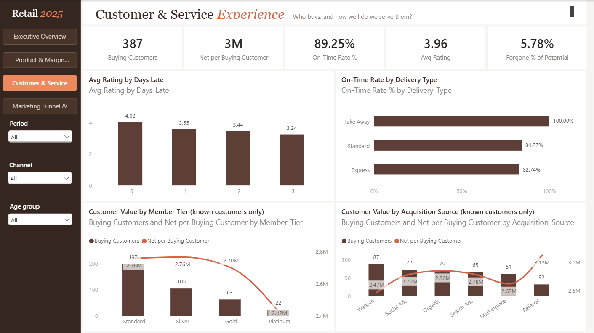
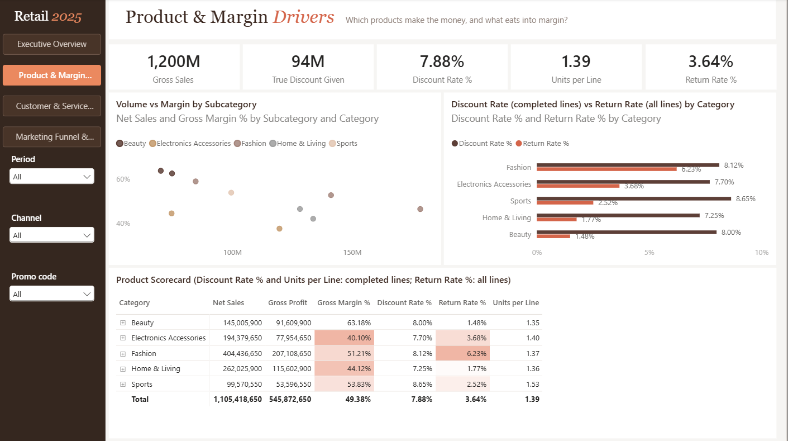
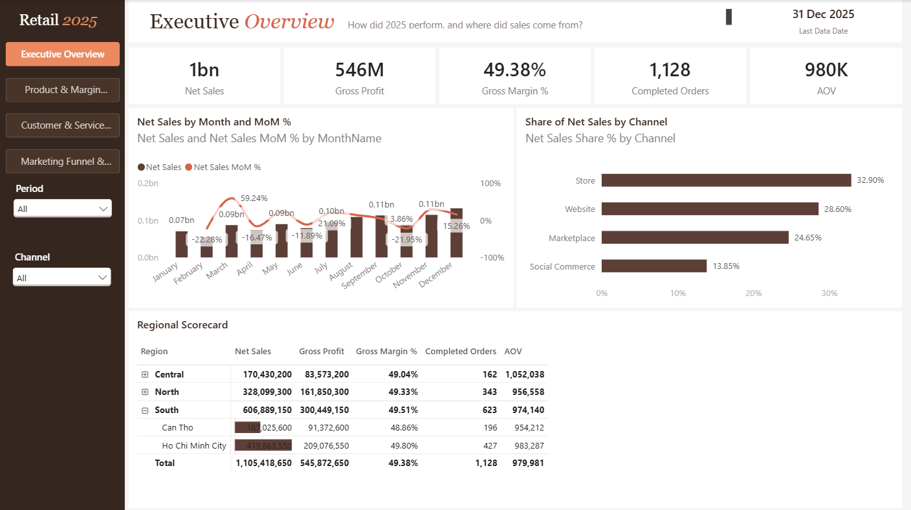
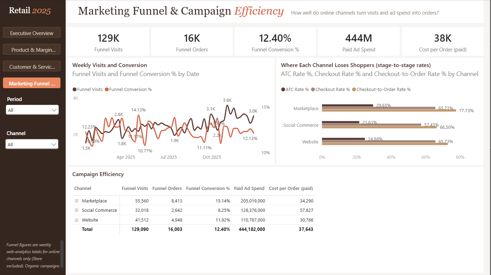
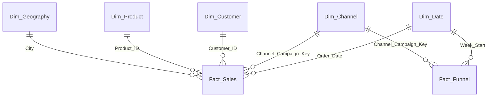

# Retail 2025 Performance Dashboard (Power BI)

A four-page Power BI report analysing a year of retail sales, product margins, customer service and online marketing funnel performance. Built as a portfolio project with Power Query, a star-schema semantic model and DAX.

> **Data note:** the dataset is a sample retail workbook sourced from [duadata.net](https://duadata.net/s/bWM4NhZNcS). It shows signs of being generated, so treat the figures as sample data, not a real company's results. The shared sheet states no author and no licence terms beyond an "as is, for informational purposes only" disclaimer, so its licence and redistribution terms are unconfirmed. The source does not state a currency, so amounts are shown without a currency symbol.

## Overview

The report covers **1,650 order lines (1,181 orders) placed between 1 January and 31 December 2025** across four sales channels, plus **52 weeks of online marketing funnel data**. Each page answers one business question and shares a common layout: a navigation rail with filters on the left, five KPI cards across the top, two charts in the middle and detail visuals at the bottom.

## Screenshots

**1. Executive Overview**



**2. Product & Margin Drivers**



**3. Customer & Service Experience**



**4. Marketing Funnel & Campaign Efficiency**



## Business Questions

| # | Page | Question it answers |
|---|---|---|
| 1 | Executive Overview | How did 2025 perform, and where did sales come from? |
| 2 | Product & Margin Drivers | Which products make the money, and what eats into margin? |
| 3 | Customer & Service Experience | Who buys, and how well do we serve them? |
| 4 | Marketing Funnel & Campaign Efficiency | How well do online channels turn visits and ad spend into orders? |

## Dashboard

Every page has a page navigator and **Period** (quarter → month) and **Channel** filters in the left rail.

### 1. Executive Overview
- **KPI cards:** Net Sales, Gross Profit, Gross Margin %, Completed Orders, AOV, plus a "data through" date in the header.
- **Net Sales by Month and MoM %:** monthly net sales (columns) with month-over-month change (line).
- **Share of Net Sales by Channel:** each channel's share of net sales, with drill-down from channel to campaign.
- **Regional Scorecard:** a Region → City matrix with Net Sales (data bars), Gross Profit, Gross Margin %, Completed Orders and AOV.

### 2. Product & Margin Drivers
- **KPI cards:** Gross Sales (Completed), True Discount Given, Discount Rate %, Units per Line, Return Rate %.
- **Volume vs Margin by Subcategory:** a scatter of net sales against gross margin, coloured by product category.
- **Discount Rate vs Return Rate by Category:** discount rate (completed lines) against return rate (all lines).
- **Product Scorecard:** a Category → Subcategory → Product matrix. Low gross margin and high return rate are highlighted in terracotta.
- **Extra filter:** Promo code.

### 3. Customer & Service Experience
- **KPI cards:** Buying Customers, Net per Buying Customer, On-Time Rate %, Avg Rating, Forgone % of Potential (the share of potential sales lost to returns and cancellations).
- **Avg Rating by Days Late:** average customer rating for each number of days late.
- **On-Time Rate by Delivery Type:** share of delivered lines that arrived on time, per delivery type.
- **Customer value by Member Tier and by Acquisition Source:** buying customers (columns) and net sales per buying customer (line), for known customers only.
- **Extra filter:** Age group.

### 4. Marketing Funnel & Campaign Efficiency
- **KPI cards:** Funnel Visits, Funnel Orders, Funnel Conversion %, Paid Ad Spend, Cost per Order (paid).
- **Weekly Visits and Conversion:** weekly visits with conversion rate over time.
- **Where Each Channel Loses Shoppers:** add-to-cart, checkout and checkout-to-order rates per channel.
- **Campaign Efficiency:** a Channel → Campaign table.
- **Online only:** a page filter excludes the Store channel, which has no funnel data.

The report uses a custom theme ("Espresso Terracotta"). Espresso brown is the main data colour. Terracotta is the accent, used for:
- secondary measures, such as the MoM % and conversion lines;
- the selected page button;
- low margins and high return rates in the product scorecard.

## Key Insights

All figures are for the 2025 sample dataset, as calculated by the report's measures.

| Area | What the data shows |
|---|---|
| Overall | Net sales of about **1.11bn** at a **49.38%** gross margin, from **1,128** completed orders (average order value ≈ 980k). |
| Trend | Sales grow through the year: Q4 net sales are about **58% higher than Q1**. December is the strongest month (132.07M) and February the weakest (54.64M). Month-over-month change ranges from −22.28% (Feb) to +59.24% (Mar). With only one year of data, growth and seasonality can't be told apart. |
| Channels & regions | Store brings in the largest share of net sales (**32.90%**) and Social Commerce the smallest (**13.85%**). The South region accounts for about **55%** of net sales, but gross margin is almost identical across regions (49.04%–49.51%). |
| Product margin | Product mix drives margin: **Beauty** runs at a **63.18%** gross margin and **Electronics Accessories** at **40.10%**. Fashion is the largest category, at 36.59% of net sales. |
| Discounts | **94.50M** of discounts were given on 1,199.92M of completed gross sales (**7.88%**). All of it is on lines with a promo code. Discount rates are similar across categories (7.25%–8.65%). |
| Returns | **3.64%** of order lines were returned. **Fashion** has the highest return rate (**6.23%**) and 34 of the 60 returned lines. Returns and cancellations together cost **5.78%** of potential net sales. |
| Delivery & ratings | **89.25%** of delivered lines arrived on time. Express (82.74%) is slightly less punctual than Standard (84.27%), and Take Away is always on time. Average rating falls from **4.02** for on-time lines to **3.24** at three days late, but each late group has only about 40 rated lines, so this is a direction, not a precise effect. |
| Customers | **387** buying customers spent about **2.73M** each. Member tier doesn't separate customer value: Standard members spend 2.76M per buyer and Platinum 2.42M, but Platinum has only 22 buyers. Referral customers spend the most per buyer (3.13M, 32 buyers) and walk-in customers the least (2.47M). |
| Funnel | **129,090** visits produced **16,003** funnel orders (**12.40%** conversion). Marketplace converts best (15.14%). Social Commerce converts worst (8.25%) and has the lowest rate at every funnel step. Paid cost per order averages **37,643**, from 6,411 for Website Email CRM to 75,634 for Social Ads. |

## Data

The source is an Excel workbook containing four data tables, matching those in the [shared dataset](https://duadata.net/s/bWM4NhZNcS). The workbook is not included in this repository, because `.gitignore` excludes all `.xlsx` files. See [How to Use](#how-to-use) for getting your own copy and connecting it.

| Sheet / Excel table | Rows | Grain | Loaded as |
|---|---|---|---|
| Sales / `SalesTable` | 1,650 | One row per order line (1,181 orders) | `Fact_Sales`; also the source of `Dim_Channel` and `Dim_Geography` |
| Customers / `CustomersTable` | 420 | One row per customer | `Dim_Customer` |
| Products / `ProductsTable` | 40 | One row per product | `Dim_Product` |
| Marketing_Funnel / `MarketingFunnelTable` | 156 | One row per week and online channel (52 weeks × 3 channels) | `Fact_Funnel` |
| Data_Dictionary | — | Column descriptions (in Vietnamese) | Not loaded |

**Sales data:**
- **Channels:** 4 (Store, Website, Marketplace, Social Commerce), making 13 channel–campaign combinations.
- **Geography:** 6 cities in 3 regions (North, Central, South).
- **Products:** 5 categories and 10 subcategories.
- **Line status:** 1,559 Completed, 60 Returned and 31 Cancelled.
- **Other fields:** 6 promo codes and 3 delivery types (Standard, Express, Take Away).

**Funnel data:** weekly visits, add-to-cart, checkout, orders and ad spend for Website, Marketplace and Social Commerce. The data starts in the week of 6 January 2025 and covers 10 channel–campaign combinations.

## Data Preparation

All preparation is done in Power Query (M):

- **`Fact_Sales`:**
  - Removed the precomputed `Profit_Margin` column; margin is calculated as a measure instead.
  - Replaced missing customer IDs with `Unknown` (guest purchases) and missing promo codes with `No promo`.
  - Converted blank text in `Delivery_Days` to null before setting data types.
  - Renamed `Delivery_Days` to `Days_Late`, because it measures days late against the promised date, not delivery duration.
  - Set data types for all columns.
  - Added a `Channel_Campaign_Key` column (channel + campaign).
- **`Fact_Funnel`:**
  - Removed the precomputed ratio columns (`ATC_Rate`, `Checkout_Rate`, `Conversion_Rate`, `Cost_per_Order`); these ratios are recalculated as DAX measures so they stay correct when aggregated.
  - Set data types and added `Channel_Campaign_Key`.
- **`Dim_Customer`:** set data types and added an `Unknown` member so guest purchases still link to a customer row.
- **`Dim_Product`:** set data types.
- **`Dim_Channel` and `Dim_Geography`:** built as distinct lists of channel/campaign and city/region from the sales table.
- **`Dim_Date`:** generated in Power Query for 1 Jan – 31 Dec 2025, with Year, MonthNumber, MonthName and Quarter.

Missing customer ratings are left blank rather than replaced with zero, so they don't pull averages down.

## Data Modeling

A star schema with two fact tables sharing conformed dimensions:



| Table | Type | Rows |
|---|---|---|
| `Fact_Sales` | Fact | 1,650 |
| `Fact_Funnel` | Fact | 156 |
| `Dim_Date` | Dimension (marked as date table) | 365 |
| `Dim_Customer` | Dimension | 421 (420 + `Unknown`) |
| `Dim_Product` | Dimension | 40 |
| `Dim_Channel` | Dimension | 13 |
| `Dim_Geography` | Dimension | 6 |

- **Relationships:** all are many-to-one and filter in a single direction, from dimension to fact.
- **Channel key:** `Dim_Channel` is keyed on channel *and* campaign, because the "Seasonal Sale" campaign runs in both Store and Website.
- **Hidden fact columns:** the channel/campaign columns on the fact tables are hidden, so every visual filters through `Dim_Channel`.
- **No fact-to-fact relationship:** the two fact tables aren't linked, because funnel orders and sales orders are separate populations (see Limitations).
- **Month sorting:** `Dim_Date[MonthName]` is sorted by `MonthNumber`.
- **Auto date/time:** Power BI's auto date/time is still on, so the model keeps hidden local date tables for the other date columns (join, launch, promised and delivered dates). The report uses `Dim_Date` for all time analysis.

## DAX / Measures

The model has **41 measures**: 32 on `Fact_Sales` and 9 on `Fact_Funnel`. The report pages use 26 of them. The rest are either building blocks for other measures (for example previous-month sales) or extra metrics that aren't shown (for example rating response rates and a completed-only average rating).

| Area | Measures |
|---|---|
| Sales & profit | Net Sales, Gross Profit, Gross Margin %, Completed Orders, AOV, Net Sales Share %, Last Data Date |
| Time comparison | Net Sales PM, Net Sales MoM Δ, Net Sales MoM % |
| Discounts & basket | Gross Sales (Completed), True Discount Given, Discount Rate %, Units per Line |
| Returns & lost sales | Returned Lines, Return Rate %, Forgone Net Sales, Potential Net Sales, Forgone % of Potential, Return Handling Cost |
| Customers | Buying Customers, Net Sales (known cust), Net per Buying Customer |
| Delivery & ratings | Delivered Lines, On-Time Rate %, Rated Lines, Avg Rating, Avg Rating (Completed), Rated Lines (Completed), Completed Lines, Rating Response Rate %, Rating Response Rate % (Completed) |
| Funnel & marketing | Funnel Visits, Funnel Orders, Funnel Conversion %, Paid Ad Spend, Paid Orders, Cost per Order (paid), ATC Rate %, Checkout Rate %, Checkout-to-Order Rate % |

Some design choices behind them:

- **Order status is handled inside the measures**, not with a status filter. Profit, margin, discounts, units per line and completed orders use completed lines; returns are measured separately.
- **Ratios are ratio-of-sums using `DIVIDE`**, never averages of precomputed row-level ratios.
- **Lost revenue is reconstructed** as `Gross_Sales × (1 − Discount_Pct)`, because `Net_Sales` is recorded as 0 on returned and cancelled lines.
- **Time comparisons use `DATEADD` over the marked date table.** `Last Data Date` shows the latest order date in the data (31 Dec 2025) instead of relying on today's date.
- **Cost per order counts paid rows only** (ad spend > 0), so organic campaigns with no spend don't distort it.

Examples:

```dax
Gross Profit =
    CALCULATE( SUM( Fact_Sales[Gross_Profit] ),
               KEEPFILTERS( Fact_Sales[Order_Status] = "Completed" ) )

Gross Margin % = DIVIDE( [Gross Profit], [Net Sales] )

Net Sales PM = CALCULATE( [Net Sales], DATEADD( Dim_Date[Date], -1, MONTH ) )

Net Sales Share % =
    DIVIDE( [Net Sales],
            CALCULATE( [Net Sales], REMOVEFILTERS( Dim_Channel ) ) )

On-Time Rate % =
    DIVIDE( CALCULATE( [Delivered Lines], KEEPFILTERS( Fact_Sales[Days_Late] = 0 ) ),
            [Delivered Lines] )

Cost per Order (paid) = DIVIDE( [Paid Ad Spend], [Paid Orders] )
```

## Tools & Technologies

| Tool | Used for |
|---|---|
| Power BI Desktop | Hosting the model during development, and reviewing and adjusting the report. The project is saved as a Power BI Project (PBIP) with a TMDL semantic model and a PBIR report definition |
| Power Query (M) | Loading and cleaning the Excel tables; generating the date table |
| DAX | The 41 measures |
| Excel workbook | Source data (.xlsx) |
| Claude Code | AI-assisted development (see below) |
| Power BI Modeling MCP server (Microsoft) | Building the semantic model and running read-only DAX validation queries |
| Power BI Report MCP server (`powerbi-report-mcp`) | Creating, formatting and validating the report pages in PBIR format |
| Python (pandas) and SQLite | Profiling the source data and cross-checking key figures (not part of the report) |

## AI-Assisted Development

I built this project with **Claude Code** and two MCP servers that let it read and write Power BI files. Claude Code did much of the implementation, but the direction came from me. I chose the business questions, decided how the key metrics are defined, approved each design before it was built, and reviewed the results in Power BI Desktop. Claude Code proposed options and did the build work within those constraints.

| Stage | My decisions | What Claude Code did | How it was checked |
|---|---|---|---|
| Data profiling and questions | Chose which business questions to keep; set metric rules such as gross margin on completed lines only, no currency symbol, and no ROAS | Profiled the workbook and proposed questions, measures and data pitfalls | Profile figures computed twice by independent methods (pandas and SQLite) |
| Semantic model | Approved the written specification | Built the Power Query steps, tables, relationships, date table and 41 measures through the Power BI Modeling MCP, in a planner → coder → tester → reviewer agent workflow | Read-only DAX queries against reconciliation figures. A bug in On-Time Rate % was found, fixed and re-tested before sign-off |
| Report pages | Approved a four-page blueprint; required one page at a time; set constraints (e.g. time fields only from `Dim_Date`, no `Order_Status` in visuals) | Built each page with the Power BI Report MCP | Layout checked with the MCP's wireframe validator and every visual's data bindings read back. Each page was started only after my go-ahead, and I reviewed the pages in Power BI Desktop |
| Visual design | Chose the reference style and colour palette, the meaning of the conditional formatting, and to keep the category colours on the scatter chart | Created the custom theme and per-page formatting, starting with Page 1 for approval | Reviewed in Desktop; I made the final manual layout adjustments |

Where the MCP tools fell short, Claude Code edited the PBIR JSON files directly. Examples include correcting a page filter the tool had written as "greater than" instead of "not equal", and adding multi-style title text and matrix data bars. Claude Code worked on the project files and couldn't see the rendered report, so all visual checks were done by me in Power BI Desktop.

## Project Structure

```text
.
├── retail_dashboard.pbip                  # Open this file in Power BI Desktop
├── retail_dashboard.SemanticModel/
│   └── definition/
│       ├── model.tmdl
│       ├── relationships.tmdl
│       └── tables/                        # One .tmdl per table: columns, Power Query (M) and DAX measures
├── retail_dashboard.Report/
│   ├── definition/
│   │   ├── report.json
│   │   └── pages/                         # One folder per page, one JSON file per visual (PBIR)
│   └── StaticResources/
│       └── RegisteredResources/           # Custom theme (Espresso Terracotta)
├── screenshots/                           # Images of the four report pages shown above
├── .gitignore                             # Excludes Power BI's local cache and settings, .xlsx and .pbix files
└── README.md
```

## How to Use

**Requirements:**
- A recent version of Power BI Desktop (Windows) that supports Power BI Project (`.pbip`) files and the PBIR report format.
- Your own copy of the source workbook, if you want to load or refresh the data. It is not included in this repository. Download the [shared dataset](https://duadata.net/s/bWM4NhZNcS) as an Excel workbook (`.xlsx`) and save it anywhere on your computer. The queries read four Excel tables by name: `SalesTable`, `CustomersTable`, `ProductsTable` and `MarketingFunnelTable`. If your download doesn't contain them, format each sheet's data as a table (**Insert → Table**) and give it the matching name (**Table Design → Table Name**), keeping the original column headers.

**Open the report:**
1. Open `retail_dashboard.pbip` in Power BI Desktop.
2. Point the queries at your copy of the workbook. All six import queries read it from a hard-coded local path, `C:\AI-Agent-Team\retail_sales_2025.xlsx`, so refresh fails until you change it. Go to **Home → Transform data → Data source settings**, select that file, choose **Change Source**, and browse to your copy.
3. Select **Refresh**. A copy cloned from a Git repository opens without data until you refresh, because `.gitignore` excludes Power BI's local data cache (`.pbi/cache.abf`).

**Explore:**
- **Change pages** with the buttons in the left rail. In Desktop's editing view, hold **Ctrl** and click; in Reading view, or after publishing, a normal click works.
- **Filter** with the dropdowns in the rail: Period (quarter → month), Channel, Promo code (page 2) and Age group (page 3). Filters only apply to the page they're on.
- **Cross-filter** by clicking a bar, point or row to filter the other visuals on the page. On page 1, the channel chart can drill down from channel to campaign.

## Limitations / Notes

- **Sample data:** the source sheet ([duadata.net](https://duadata.net/s/bWM4NhZNcS)) states no author and no licence, and the data shows signs of being generated, so the insights describe this dataset only and its redistribution terms are unconfirmed.
- **Hard-coded source path:** every import query points to `C:\AI-Agent-Team\retail_sales_2025.xlsx`, the location used when the model was built. There is no path parameter, so on any other computer the data source must be changed before refreshing (see How to Use).
- **One year only:** there is no year-over-year comparison, and January has no month-over-month value.
- **No currency:** amounts are shown without a currency symbol because the source doesn't state one.
- **Funnel and sales are separate populations:** the funnel's 16,003 orders don't match the 752 online sales orders with a completed line, so the two fact tables aren't linked and no ROAS or revenue-per-visit is calculated. Page 4 uses funnel measures only, and the funnel has no Store data.
- **Different populations for different measures:** profit, margin, discounts, units per line and completed orders use completed lines. Return Rate % uses all lines, and it is a share of order lines, not orders, because one order can have lines with different statuses. On the product page, visual titles state which population applies.
- **Guest purchases:** 68 lines with no customer ID (4.40% of net sales) are grouped as `Unknown`. They count in totals but are excluded from customer-level measures.
- **Small groups:** each late-delivery group has about 40 rated lines, Platinum has 22 buyers and Referral 32, so read those comparisons as directional.
- **Avg Rating includes returned lines,** which average 1.79. That makes the overall rating 3.96, against 4.03 for completed lines only. The model also has an `Avg Rating (Completed)` measure that the pages don't use.
- **`Days_Late` measures lateness against the promised date,** not delivery time.
- **Funnel weeks are dated by their Monday,** so a week that spans two months is counted in the month it starts.
